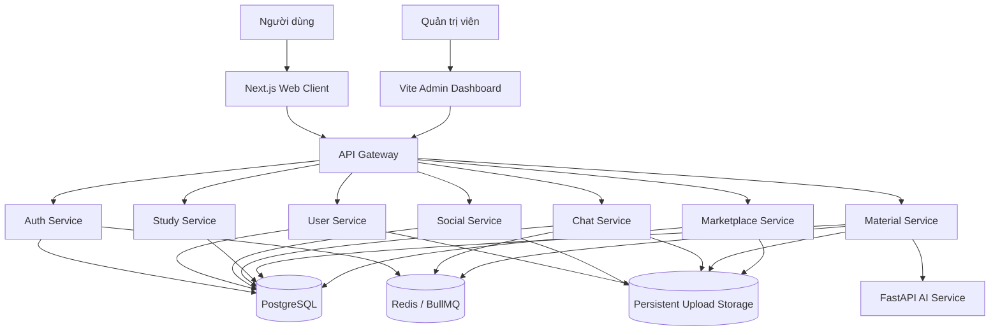

# CMC Network

<div align="center">
  <strong>Nền tảng số hợp nhất dành cho cộng đồng sinh viên Đại học CMC</strong>
  <br />
  Mạng xã hội · Học tập · Kho tài liệu AI · Trò chuyện thời gian thực · Marketplace
  <br /><br />
  <a href="https://cmcnetwork.io.vn"><strong>Truy cập hệ thống »</strong></a>
</div>

---

## Giới thiệu

CMC Network kết nối các hoạt động học tập và đời sống sinh viên trong một nền tảng duy nhất. Hệ thống được xây dựng theo kiến trúc monorepo microservice, hỗ trợ tương tác thời gian thực, xử lý tài liệu bất đồng bộ và tạo nội dung học tập trực tiếp từ PDF bằng AI.

> **Trạng thái:** đang phát triển và vận hành thực tế. API, schema dữ liệu và cấu hình triển khai có thể tiếp tục thay đổi.

## Mục lục

- [Tính năng nổi bật](#tính-năng-nổi-bật)
- [Kiến trúc hệ thống](#kiến-trúc-hệ-thống)
- [Công nghệ](#công-nghệ)
- [Bắt đầu nhanh](#bắt-đầu-nhanh)
- [Cấu hình môi trường](#cấu-hình-môi-trường)
- [Các lệnh thường dùng](#các-lệnh-thường-dùng)
- [Xử lý tài liệu bằng AI](#xử-lý-tài-liệu-bằng-ai)
- [Lưu trữ file](#lưu-trữ-file)
- [Kiểm thử và chất lượng](#kiểm-thử-và-chất-lượng)
- [Triển khai production](#triển-khai-production)
- [Tài liệu kỹ thuật](#tài-liệu-kỹ-thuật)

## Tính năng nổi bật

| Nhóm | Khả năng chính |
|---|---|
| **Tài khoản & hồ sơ** | Đăng ký, OTP email, JWT, Microsoft SSO, hồ sơ học tập, thành tích và portfolio |
| **Mạng xã hội** | Feed, bài viết đa phương tiện, bình luận, cảm xúc, chia sẻ, bookmark và story |
| **Học tập** | Nhóm học, sự kiện, lịch học, điểm số, giảng viên và kết nối mentor |
| **Kho tài liệu** | Upload, tìm kiếm, xem, tải xuống, đánh giá và lưu tài liệu |
| **AI học tập** | Đọc PDF, tạo tóm tắt, flashcard và câu hỏi trắc nghiệm kèm giải thích |
| **Chat & cuộc gọi** | Tin nhắn cá nhân/nhóm, presence, Socket.IO và LiveKit/WebRTC |
| **Marketplace** | Đăng bán, tìm kiếm và quản lý sản phẩm trong cộng đồng sinh viên |
| **Quản trị** | Dashboard, thống kê, quản lý người dùng, nội dung và báo cáo |

## Kiến trúc hệ thống



### Danh sách ứng dụng

| Workspace | Vai trò | Cổng production |
|---|---|---:|
| `apps/web-client` | Giao diện người dùng Next.js | `3000` |
| `apps/admin-dashboard` | Giao diện quản trị Vite | `25443` |
| `apps/api-gateway` | API gateway và reverse proxy | `3001` |
| `apps/auth-service` | Xác thực và quản lý phiên | `3002` |
| `apps/user-service` | Hồ sơ, học vụ, mentor và thông báo | `3003` |
| `apps/social-service` | Feed, bài viết và tương tác | `3004` |
| `apps/chat-service` | Chat, presence và cuộc gọi | `3005` |
| `apps/study-service` | Nhóm học và sự kiện | `3006` |
| `apps/material-service` | Tài liệu, BullMQ và xử lý PDF | `3007` |
| `apps/marketplace-service` | Marketplace sinh viên | `3008` |
| `apps/ai-service` | Hỏi đáp và sinh nội dung học tập | `8000` |

Các cổng development được khai báo qua biến môi trường và có thể khác bảng trên.

### Cấu trúc repository

```text
CMC-Network/
├── apps/                    # Web, admin, backend và AI services
├── packages/
│   ├── database/            # Prisma schema, migrations và client
│   ├── common/              # Kiểu dữ liệu và tiện ích dùng chung
│   ├── cache/               # Redis helpers
│   ├── logger/              # Logging dùng chung
│   └── ui-kit/              # Thành phần giao diện dùng chung
├── infrastructure/          # Docker Compose và cấu hình hạ tầng
├── scripts/                 # Health check và automation
├── ecosystem.config.js      # Cấu hình PM2 production
├── package.json             # npm workspaces
└── turbo.json               # Turborepo task pipeline
```

## Công nghệ

| Lớp | Công nghệ |
|---|---|
| Frontend | Next.js 16, React 19, Tailwind CSS 4, TanStack Query, Zustand |
| Admin | React, Vite |
| Backend | NestJS 11, Socket.IO, BullMQ |
| AI & PDF | FastAPI, Python, OpenAI-compatible API, `pdf-parse` |
| Dữ liệu | PostgreSQL 15, Prisma 5, Redis 7 |
| Realtime | Socket.IO, LiveKit, WebRTC |
| Monorepo | npm workspaces, Turborepo |
| Vận hành | Docker Compose, PM2, Nginx |

## Bắt đầu nhanh

### Yêu cầu

- Node.js `20+`
- npm `10+`
- Python `3.10+`
- Docker Engine và Docker Compose

### 1. Clone và cài dependencies

```bash
git clone https://github.com/Tungdota53/CMC-Network.git
cd CMC-Network
npm install
```

### 2. Tạo cấu hình local

```bash
cp .env.example .env
```

Thay các giá trị mẫu trong `.env`, đặc biệt là `JWT_SECRET` và khóa AI. Không commit file môi trường hoặc secret lên Git.

### 3. Khởi động PostgreSQL và Redis

```bash
docker compose -f infrastructure/docker-compose.yml up -d
```

### 4. Chuẩn bị database

```bash
npx --workspace=@campus-connect/database prisma generate
npx --workspace=@campus-connect/database prisma migrate deploy
npm run build --workspace=packages/database
```

### 5. Chuẩn bị AI service

```bash
python3 -m venv apps/ai-service/.venv
apps/ai-service/.venv/bin/pip install -r apps/ai-service/requirements.txt
```

### 6. Chạy môi trường development

```bash
npm run dev
```

Có thể chạy riêng từng phần bằng `npm run dev:frontend`, `npm run dev:backend`, `npm run dev:admin` hoặc `npm run dev:web`.

## Cấu hình môi trường

File [`.env.example`](.env.example) mô tả đầy đủ các biến hỗ trợ. Những nhóm quan trọng gồm:

| Nhóm | Biến tiêu biểu |
|---|---|
| Database | `DATABASE_URL` |
| Cache & queue | `REDIS_URL` |
| Xác thực | `JWT_SECRET`, `JWT_EXPIRES_IN`, `ALLOWED_EMAIL_DOMAINS` |
| CORS & frontend | `ALLOWED_ORIGINS`, `FRONTEND_URL` |
| Service discovery | `AUTH_SERVICE_URL`, `USER_SERVICE_URL`, `AI_SERVICE_URL`, ... |
| Upload | `STORAGE_DRIVER`, `UPLOAD_ROOT`, `UPLOAD_PUBLIC_BASE_URL` |
| Microsoft SSO | `MICROSOFT_CLIENT_ID`, `MICROSOFT_CLIENT_SECRET`, `MICROSOFT_TENANT_ID` |
| AI | `AI_API_KEY`, `AI_API_URL`, `AI_MODEL`, `AI_MATERIAL_TIMEOUT_MS` |

> Chỉ driver lưu trữ `local` đang được triển khai hoàn chỉnh. Không đặt credential thật trong `.env.example`.

## Các lệnh thường dùng

| Lệnh | Mô tả |
|---|---|
| `npm run dev` | Chạy toàn bộ ứng dụng ở chế độ development |
| `npm run dev:frontend` | Chạy web client |
| `npm run dev:backend` | Chạy các NestJS service |
| `npm run dev:admin` | Chạy admin dashboard |
| `npm run build` | Build toàn bộ monorepo |
| `npm test` | Chạy test của tất cả workspace có test script |
| `npm run lint` | Chạy lint toàn bộ workspace |
| `npm run deploy:healthcheck` | Kiểm tra health endpoint sau triển khai |

Chạy lệnh cho một workspace cụ thể:

```bash
npm test --workspace=apps/material-service
npm run build --workspace=apps/material-service
```

## Xử lý tài liệu bằng AI

Tài liệu PDF được xử lý bất đồng bộ để upload không phụ thuộc vào thời gian phản hồi của nhà cung cấp AI:

1. `material-service` lưu file vào persistent storage và đưa job vào BullMQ.
2. Worker trích xuất, chuẩn hóa văn bản từ PDF.
3. `ai-service` yêu cầu model trả JSON có cấu trúc.
4. Kết quả được kiểm tra trước khi lưu tóm tắt, flashcard và quiz vào PostgreSQL.
5. Khi AI lỗi hoặc timeout, tài liệu vẫn chuyển sang trạng thái sẵn sàng với nội dung fallback từ văn bản đã trích xuất.

`AI_MATERIAL_TIMEOUT_MS` điều khiển timeout phía worker, mặc định là `60000` ms.

## Lưu trữ file

Upload runtime được tách khỏi source code và không được Git theo dõi:

- Local mặc định: `.data/uploads`
- Production khuyến nghị: `/var/lib/campus-connect/uploads`
- Public URL tùy chọn: `UPLOAD_PUBLIC_BASE_URL`

Khi sao lưu hoặc chuyển máy chủ, cần sao lưu đồng thời PostgreSQL và thư mục upload. Xóa repository không được xem là phương thức xóa dữ liệu runtime.

## Kiểm thử và chất lượng

Trước khi mở pull request hoặc triển khai:

```bash
npm test
npm run lint
npm run build
```

Quy ước chính:

- Giữ test `*.spec.ts` như tài sản hồi quy của sản phẩm.
- Mọi thay đổi Prisma schema phải đi kèm migration.
- Không commit upload, log, cache, build output, `.env` hoặc secret.
- Không thêm script quản trị chứa tài khoản, mật khẩu hay token viết cứng.
- Không dùng `prisma db push` thay cho migration trong production.

## Triển khai production

PM2 quản lý web client, admin dashboard, AI service và các NestJS service:

```bash
npm ci
npx --workspace=@campus-connect/database prisma generate
npx --workspace=@campus-connect/database prisma migrate deploy
npm run build
pm2 startOrReload ecosystem.config.js --update-env
pm2 save
npm run deploy:healthcheck
```

Trước khi phát hành, thực hiện đầy đủ [`DEPLOYMENT_STABILITY_CHECKLIST.md`](DEPLOYMENT_STABILITY_CHECKLIST.md). Production cần reverse proxy/TLS, secret mạnh, persistent upload storage, backup database và giám sát tiến trình.

## Tài liệu kỹ thuật

- [`API_DESIGN.md`](API_DESIGN.md) — nguyên tắc và thiết kế API.
- [`docs/API_CONTRACT_MATRIX.md`](docs/API_CONTRACT_MATRIX.md) — contract runtime đã đối chiếu theo controller.
- [`docs/LOCAL_DEVELOPMENT.md`](docs/LOCAL_DEVELOPMENT.md) — baseline môi trường local và bảng port cô lập.
- [`docs/FIX_PROGRESS_AND_PLAN.md`](docs/FIX_PROGRESS_AND_PLAN.md) — tiến độ sửa lỗi và kế hoạch các giai đoạn tiếp theo.
- [`docs/ADR-001-CANONICAL-ADMIN.md`](docs/ADR-001-CANONICAL-ADMIN.md) — quyết định ownership của dashboard quản trị.
- [`ERD.md`](ERD.md) — mô hình dữ liệu và quan hệ chính.
- [`DEPLOYMENT_STABILITY_CHECKLIST.md`](DEPLOYMENT_STABILITY_CHECKLIST.md) — checklist triển khai ổn định.
- [`SECURITY_HARDENING_AUDIT.md`](SECURITY_HARDENING_AUDIT.md) — kết quả rà soát hardening và bảo mật.

## Đóng góp

1. Tạo branch từ `main`.
2. Thực hiện thay đổi nhỏ, có phạm vi rõ ràng.
3. Bổ sung hoặc cập nhật test tương ứng.
4. Chạy test, lint và build liên quan.
5. Tạo pull request, mô tả mục tiêu, cách kiểm thử và ảnh hưởng migration nếu có.

## License

Dự án phục vụ hệ sinh thái sinh viên Đại học CMC. Quyền sử dụng và phân phối tuân theo chính sách của chủ sở hữu repository.
